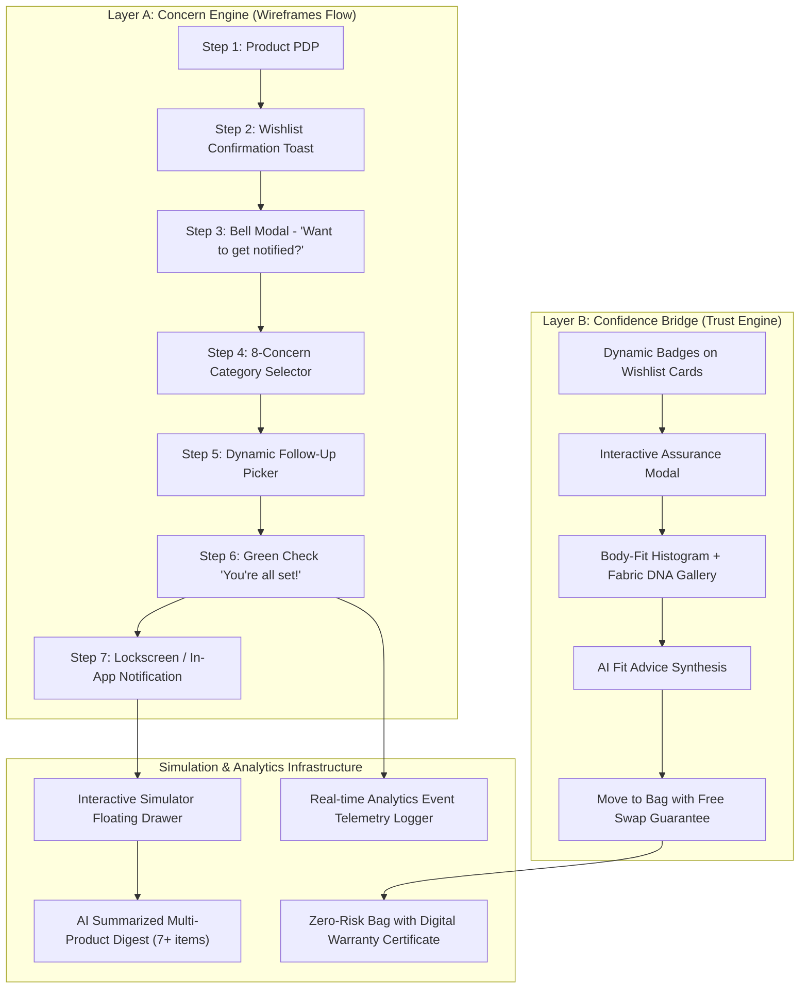
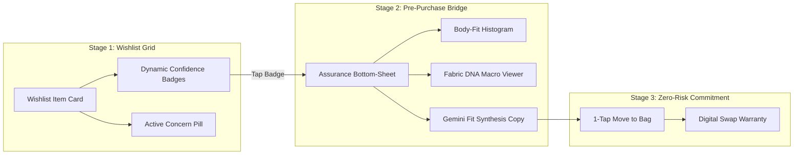

# 🚀 Myntra Wishlist AI — Master Implementation Plan

> **Document Type:** Master Implementation Plan & Work Breakdown Structure (WBS)  
> **Source References:** [problemStatement.md](file:///Users/shubhamthakur/Downloads/nextleap%20antigravity%20projects/MVP_Myntra_project/problemStatement.md) · [architecture.md](file:///Users/shubhamthakur/Downloads/nextleap%20antigravity%20projects/MVP_Myntra_project/architecture.md) · [wireframes.png](file:///Users/shubhamthakur/Downloads/nextleap%20antigravity%20projects/MVP_Myntra_project/wireframes.png)  
> **Target Surface:** Unified Mobile-First Web Application (**Single All-in-One Deployment Bundle**)  
> **Deployment Model:** **One-Go Monolithic Upload** (Frontend + In-Memory Backend Services + AI Simulation Layer packaged together in a single codebase with zero external server setup)  
> **Target Stack:** React 18 · TypeScript · Vite · Vanilla CSS / CSS Modules · Canvas Confetti · Lucide Icons  
> **Target SLA:** P95 < 120ms end-to-end  
> **Last Updated:** September 2026

---

## 📑 Table of Contents

1. [Executive Overview & Strategic Alignment](#1-executive-overview--strategic-alignment)
2. [Project Scope & Guardrail Constraints (Unified One-Go Deployment)](#2-project-scope--guardrail-constraints)
3. [Architecture-to-Implementation Mapping](#3-architecture-to-implementation-mapping)
4. [Master Work Breakdown Structure (WBS) by Phase](#4-master-work-breakdown-structure-wbs-by-phase)
   - [Phase 1: Project Scaffolding & Myntra Design System](#phase-1-project-scaffolding--myntra-design-system)
   - [Phase 2: Product Catalog & Multi-Brand Mock Data Engine](#phase-2-product-catalog--multi-brand-mock-data-engine)
   - [Phase 3: Layer A — Pixel-Perfect 7-Step Concern Flow](#phase-3-layer-a--pixel-perfect-7-step-concern-flow)
   - [Phase 4: Layer B — Pre-Purchase Confidence Bridge](#phase-4-layer-b--pre-purchase-confidence-bridge)
   - [Phase 5: Interactive Event Simulator & Notification Center](#phase-5-interactive-event-simulator--notification-center)
   - [Phase 6: AI Discovery Assistant & Conversational Search](#phase-6-ai-discovery-assistant--conversational-search)
   - [Phase 7: Zero-Risk Bag with Digital Swap Warranty](#phase-7-zero-risk-bag-with-digital-swap-warranty)
   - [Phase 8: Real-Time Analytics Event Telemetry Drawer](#phase-8-real-time-analytics-event-telemetry-drawer)
   - [Phase 9: Performance Optimization & Mobile Polish](#phase-9-performance-optimization--mobile-polish)
5. [State Management & Data Flow Architecture](#5-state-management--data-flow-architecture)
6. [Component File Structure & Module Tree](#6-component-file-structure--module-tree)
7. [API Contract & Mock Service Layer](#7-api-contract--mock-service-layer)
8. [Comprehensive Verification & Testing Protocol](#8-comprehensive-verification--testing-protocol)
9. [Milestone Checklist & Definition of Done (DoD)](#9-milestone-checklist--definition-of-done-dod)

---

## 1. Executive Overview & Strategic Alignment

### 1.1 Objective
Build a production-grade, highly interactive **mobile-first web application** that validates the two primary hypotheses from research:
1. **Hypothesis 1 (Personalized Concern Resolution):** Allowing users to declare why they are postponing a wishlisted purchase (Size, Price, Colour, Delivery, Quality, Date) and proactively notifying them when that condition changes breaks the 30-day dormancy cycle.
2. **Hypothesis 2 (Pre-Purchase Confidence Bridge):** Surfacing crowd-sourced fit consensus, verified fabric DNA, and zero-fee swap guarantees resolves information asymmetry and risk perception at the point of hesitation.

### 1.2 Unified Deployment Paradigm ("One-Go" Delivery)
> **CRITICAL ARCHITECTURAL DIRECTIVE: ALL-IN-ONE SINGLE REPO DEPLOYMENT**  
> To eliminate deployment complexity and multi-service orchestrations, the entire MVP is engineered as a **self-contained, unified single-bundle application**. 
> - **No Independent Backend Server Required:** All backend business logic (Wishlist CRUD, Concern capturing, Trigger condition evaluation, Confidence badge computation, AI fit synthesis, and Notification dispatching) is implemented as an integrated, reactive in-memory service layer directly within the application bundle.
> - **Single-Command Execution:** The application builds, runs, tests, and deploys with standard frontend tooling (`npm install && npm run dev` / `npm run build`), ready to be uploaded or hosted anywhere in one go.

### 1.3 Target Business Metrics
- **North Star:** Lift 30-day Wishlist-to-Purchase Conversion from **16.0% baseline ➔ 20.0%–21.0% (+3.5 to +5.0 pp)**.
- **Estimated Financial Value:** **₹635 Cr to ₹1,270 Cr** incremental annualized GMV at zero discount expenditure.
- **Gross Margin Preservation:** 100% margin integrity preserved (zero coupon/cashback subsidies).

---

## 2. Project Scope & Guardrail Constraints

### 2.1 Core Constraints (Non-Negotiable)
- **Unified Single-Bundle Deployment (No Separate Backend/DB Setup):** Frontend UI, simulated service layer, reactive state stores, mock catalog data, and trigger event simulators are co-located in one single project for instant 1-go uploading and evaluation.
- **Strict Zero-Discount Constraint:** No coupon codes, markdown countdown timers, cashback banners, or promotional gimmicks.
- **Pixel-Fidelity to Wireframes:** The 7-step concern capture flow must mirror [wireframes.png](file:///Users/shubhamthakur/Downloads/nextleap%20antigravity%20projects/MVP_Myntra_project/wireframes.png) in layout, typography, button states, and copy.
- **Mobile-First Experience:** Engineered for viewport dimensions 360px–430px, with a responsive desktop frame featuring bezel/device toggles (iPhone 15 Pro, Pixel 8, Fullscreen).
- **Sub-120ms Latency SLA:** Zero UI stuttering, optimistic state mutations, and sub-5ms cached badge rendering.

---

## 3. Architecture-to-Implementation Mapping



---

## 4. Master Work Breakdown Structure (WBS) by Phase

```
┌───────────────────────────────────────────────────────────────────────────────────┐
│                               MASTER WBS PHASES                                   │
├────────┬──────────────────────────────────────────────────────────────────────────┤
│ Phase 1│ Project Scaffolding & Myntra Design System (Variables, Tokens, Shell)   │
│ Phase 2│ Product Catalog & Multi-Brand Mock Data Engine (8 authentic items)       │
│ Phase 3│ Layer A: Pixel-Perfect 7-Step Concern Flow (Matching wireframes.png)     │
│ Phase 4│ Layer B: Pre-Purchase Confidence Bridge (3-Stage Trust Engine)           │
│ Phase 5│ Interactive Event Simulator & Notification Center (Single + AI Digest)   │
│ Phase 6│ AI Discovery Assistant & Conversational Search (Explore Tab)             │
│ Phase 7│ Zero-Risk Bag with Digital Swap Warranty & Checkout Experience           │
│ Phase 8│ Real-Time Analytics Event Telemetry Drawer                               │
│ Phase 9│ Performance Tuning (<120ms SLA), Verification & Build Polish             │
└────────┴──────────────────────────────────────────────────────────────────────────┘
```

---

### Phase 1: Project Scaffolding & Myntra Design System

#### 1.1 Foundation Setup
- [x] Configure `package.json` with React 18, TypeScript, Vite 4, Lucide React, and Canvas Confetti.
- [x] Configure `tsconfig.json` and `tsconfig.node.json` for strict TypeScript resolution.
- [ ] Create `vite.config.ts` with React plugin and path aliases (`@/` mapping to `src/`).
- [ ] Create `index.html` with Google Fonts (`Assistant`, `Inter`, `Outfit`) and Myntra branding metadata.

#### 1.2 Myntra Design System (`src/styles/`)
- [ ] **`src/styles/variables.css`**: Define authentic Myntra design tokens:
  - **Colors:**
    - Primary Pink: `#ff3f6c`
    - Primary Pink Dark: `#e72754`
    - Primary Pink Light/Soft: `#fff1f4`
    - Deep Charcoal Navy: `#282c3f`
    - Slate Gray: `#535766`
    - Light Muted Gray: `#94969f`
    - Border Gray: `#eaeaec`
    - Background Tint: `#f5f5f6`
    - Pure White: `#ffffff`
    - Success Green: `#03a685`
    - Success Green Light: `#e6f7f4`
    - Warning Amber: `#ff9800`
    - Warning Amber Light: `#fff8e1`
    - Info Blue: `#1976d2`
    - Info Blue Light: `#e3f2fd`
  - **Typography:**
    - Assistant / Inter with precise line-heights, letter-spacing, and weight hierarchy (`400`, `600`, `700`, `800`).
  - **Shadows & Elevation:**
    - Low: `0 1px 4px rgba(40, 44, 63, 0.08)`
    - Medium: `0 4px 16px rgba(40, 44, 63, 0.12)`
    - High: `0 8px 32px rgba(40, 44, 63, 0.18)`
  - **Border Radii:** `4px`, `8px`, `12px`, `16px`, `24px`, `9999px` (pill).
- [ ] **`src/styles/globals.css`**: CSS resets, custom scrollbars, animations (`fadeIn`, `slideUp`, `bounce`, `pulseGlow`, `shimmer`).
- [ ] **`src/styles/animations.css`**: Smooth micro-interactions for heart clicks, popup sheets, and toast notifications.

#### 1.3 Mobile App Shell (`src/components/shell/`)
- [ ] **`MyntraShell.tsx`**:
  - Device frame wrapper for desktop (iPhone 15 Pro bezel with dynamic island / speaker notch, toggleable to Pixel 8 or Fullscreen mode).
  - Responsive full-bleed container on real mobile devices (`100dvh`).
  - Top Status Bar (9:41, WiFi icon, 5G icon, Battery indicator).
  - Sticky Top Bar (`TopBar.tsx`) with Back button, Myntra Logo glyph, Search shortcut, Wishlist icon (with badge counter), and Bag icon (with badge counter).
  - Sticky Bottom Navigation Bar (`BottomNavBar.tsx`) with 5 tabs:
    1. 🏠 **Home** (Catalog browsing)
    2. 🔍 **Explore** (AI Discovery Assistant)
    3. ❤️ **Wishlist** (Smart Wishlist with badges & concerns)
    4. 🛍️ **Bag** (Zero-Risk Bag with Swap Warranty)
    5. 👤 **Profile** (User settings, Fit Profile, Notification Center)

---

### Phase 2: Product Catalog & Multi-Brand Mock Data Engine

#### 2.1 Rich Fashion Catalog (`src/data/mockCatalog.ts`)
Implement 8 realistic fashion items spanning diverse Indian and global partner brands:

| ID | Brand | Product Title | Price | MRP | Category | Primary Focus |
|:---|:---|:---|:---:|:---:|:---|:---|
| `prod-1` | **HRX by Hrithik Roshan** | Men Green Solid Casual Shirt | ₹1,299 | ₹1,799 (28% OFF) | Western Wear / Shirts | **Matching Wireframes Exactly** (Size XL Out of Stock trigger) |
| `prod-2` | **Roadster** | Women Embroidered Pure Cotton A-Line Kurta | ₹899 | ₹1,499 (40% OFF) | Ethnic Wear | High Fit Uncertainty (Roadster sizing vs. Mango) |
| `prod-3` | **Mango** | Women Relaxed Fit Linen Blend Tailored Blazer | ₹3,490 | ₹4,990 (30% OFF) | Western Wear | Fabric Opacity & Premium Weave verification |
| `prod-4` | **Tokyo Talkies** | Floral Print Flared Midi Dress | ₹999 | ₹1,999 (50% OFF) | Dresses | Color Daylight Accuracy & Bust Drape |
| `prod-5` | **Anouk** | Chanderi Silk Festive Kurta with Dupatta | ₹1,899 | ₹3,299 (42% OFF) | Ethnic Festive | Purchase Timing (Salary Day / Festive Reminder) |
| `prod-6` | **Levi's** | 511 Slim Fit Stretchable Denim Jeans | ₹2,499 | ₹3,999 (37% OFF) | Bottomwear | True-to-Size 92% Consensus & Zero-Fee Swap |
| `prod-7` | **Red Tape** | Men Classic White Leather Court Sneakers | ₹1,599 | ₹3,599 (55% OFF) | Footwear | Size 9 Restock & Comfort Rating |
| `prod-8` | **H&M** | Ribbed Knit Cropped Top | ₹699 | ₹999 (30% OFF) | Tops | Fabric Stretch & Transparency Score |

#### 2.2 Deep Metadata per Product
Each product object will carry:
- `availableSizes`: Array of `{ size: 'XS' | 'S' | 'M' | 'L' | 'XL' | 'XXL' | 'XXXL', inStock: boolean, stockCount: number }`
- `availableColors`: Array of `{ name: string, hex: string, inStock: boolean, image: string }`
- `fabricDNA`: `{ material: string, composition: string, gsmWeight: number, opacityScore: number (1-5), breathabilityScore: number (1-5), weaveType: string, macroImages: string[] }`
- `fitConsensus`: `{ trueToSizePct: number, totalVoters: number, runsSmallPct: number, trueToSizeCount: number, runsLargePct: number, userHeightHistogram: Array<{ heightRange: string, fitMatchPct: number }> }`
- `swapEligibility`: `{ isEligible: boolean, swapFee: number (0), dispatchHub: string, estimatedDays: number }`
- `reviewsData`: `{ rating: number, totalReviews: number, verifiedPhotosCount: number, recentCustomerFeedback: Array<{ user: string, height: string, purchasedSize: string, comment: string, date: string, photoUrl?: string }> }`

---

### Phase 3: Layer A — Pixel-Perfect 7-Step Concern Flow

Implement the exact flow demonstrated in [wireframes.png](file:///Users/shubhamthakur/Downloads/nextleap%20antigravity%20projects/MVP_Myntra_project/wireframes.png):

```
┌─────────────────────────────────────────────────────────────────────────────────┐
│                        7-STEP CONCERN NOTIFICATION FLOW                         │
├─────────┬───────────────────────────────┬───────────────────────────────────────┤
│ Step 1  │ Product Page (PDP)            │ Full PDP with Heart & Add-to-Bag CTAs │
│ Step 2  │ Wishlist Banner Toast         │ "Added to Wishlist • We'll notify..." │
│ Step 3  │ Bell Prompt Popup Bottomsheet │ "Want to get notified when resolved?" │
│ Step 4  │ 8-Concern Category Selector   │ Size, Price, Colour, Delivery, etc.   │
│ Step 5  │ Dynamic Sub-Flow Selector     │ Granular size/price/color/date picker │
│ Step 6  │ Green Check Confirmation      │ "You're all set! We'll notify you..." │
│ Step 7  │ Simulated iOS Push Banner     │ "🔔 Good news! The XL size is back..."│
└─────────┴───────────────────────────────┴───────────────────────────────────────┘
```

#### Detailed Component Breakdown for Layer A:
1. **Step 1: Product Detail View (`ProductDetailModal.tsx` / `PDP`)**:
   - Product gallery with swipeable high-res photos.
   - Brand name in bold uppercase, product title, star rating pill (`4.3 ★ | 12.6k`).
   - Price row: `₹1,299` in bold dark, `₹1,799` strikethrough, `(28% OFF)` in coral orange, *"Inclusive of all taxes"*.
   - Size grid selector: `S`, `M`, `L`, `XL` (with red tag *"Only 2 left"* or *"Out of Stock"*), `XXL`.
   - Action Bar: Share icon, Wishlist Heart button (unfilled outline), Primary Pink **`ADD TO BAG`** button.

2. **Step 2: Wishlist Confirmation Toast (`WishlistToast.tsx`)**:
   - Slides up smoothly immediately upon tapping Heart.
   - Green check circle icon + text: *"Added to Wishlist • We'll notify you if there are updates on your concern. View Wishlist >"*.
   - Close `✕` button.

3. **Step 3: Initial Concern Popup (`ConcernInitialPopup.tsx`)**:
   - Bottom-sheet modal with clean backdrop blur.
   - Illustrated vibrating bell icon in soft pink circle badge.
   - Headline: **"Want to get notified when your concern is resolved?"**
   - Subtitle: *"We'll notify you when there's an update."*
   - Primary CTA: **`YES, NOTIFY ME`** (Solid Myntra Pink `#ff3f6c`, bold uppercase).
   - Secondary CTA: **`NOT NOW`** (Ghost / dark text button).

4. **Step 4: Concern Category Selector (`ConcernCategorySelector.tsx`)**:
   - Headline: **"What would you like to be notified about?"**
   - 8 interactive radio items with distinct icons:
     1. 👕 **Size** — *"When my size is available"*
     2. 💰 **Price** — *"When price drops"*
     3. 🎨 **Colour** — *"When my preferred colour is available"*
     4. 🚚 **Delivery** — *"When delivery is faster / policy changes"*
     5. 🔍 **Quality / Product info** — *"When more info or reviews are available"*
     6. 📅 **Purchase timing** — *"Remind me on a specific date"*
     7. 💬 **Other** — *"Other concern"*

5. **Step 5: Dynamic Follow-Up Sub-Flows (`ConcernSubFlowModal.tsx`)**:
   - Top Back Arrow `←` + Title Header (e.g., **"Size"**).
   - Dynamic content based on selection:
     - **Size Flow:** *"Which size are you looking for?"* + Grid of size chips (`XS`, `S`, `M`, `L`, `XL` with active pink outline, `XXL`, `XXXL`) + `SAVE` / `CANCEL`.
     - **Price Flow:** *"When would you like to be notified?"* + Options: *"Notify me on any price drop"* or Custom Target Price Slider + `SAVE`.
     - **Colour Flow:** *"Which colour are you looking for?"* + Palette of color swatches (Navy, Olive Green, Black, Maroon) + `SAVE`.
     - **Delivery Flow:** *"Current delivery: 3–5 days to 560001"* + Options: *"Notify if Express 24hr delivery becomes available"* + `SAVE`.
     - **Quality / Info Flow:** *"What information are you waiting for?"* + Checkboxes: *"Verified Customer Fabric Photos"*, *"Sizing Reviews from similar body types"*, *"Fabric Opacity & Shrinkage tests"* + `SAVE`.
     - **Purchase Timing Flow:** *"When should we remind you?"* + Chips: `2nd of month (Salary)`, `3rd of month`, `Next Weekend`, `Custom Date Calendar` + `SAVE`.
     - **Other Flow:** *"Tell us your specific concern"* + Clean text area with character counter + `SAVE`.

6. **Step 6: Confirmation Screen (`ConcernConfirmationModal.tsx`)**:
   - Centered celebration card with animated green circle checkmark (`#03a685`).
   - Headline: **"You're all set!"**
   - Subtitle: *"We'll notify you when [e.g. XL size is available / price drops / on 3rd October]."*
   - Action Button: **`DONE`** (Solid Myntra Pink, closes modal and returns smoothly).

7. **Step 7: Realistic Notification Simulation (`LockscreenNotification.tsx`)**:
   - Renders realistic lockscreen banner or top in-app notification banner:
     - Myntra app icon + *"Myntra • now"*
     - *"🔔 Good news! The XL size you wanted is now available. Tap to view the product."*
   - Interactive tap: Clicking the notification directly opens the product PDP with size XL highlighted and ready to move to bag!

---

### Phase 4: Layer B — Pre-Purchase Confidence Bridge

Implement the 3-Stage Trust Engine inside the Smart Wishlist:



#### Detailed Features for Layer B:
1. **Stage 1: Wishlist Cards (`WishlistCard.tsx`)**:
   - High-res product thumbnail with quick remove `✕` icon.
   - Brand, Product Title, Price, and Discount tags.
   - **Dynamic Confidence Badges**:
     - 🟢 **88% True to Size** (320 buyers)
     - 🧵 **Pure Combed Cotton (4.6★ Fabric Score)**
     - 🔄 **Zero-Fee Doorstep Swap Guaranteed**
   - **Active Concern Status Pill** (if a concern is active):
     - `🔔 Watching: Size XL` or `🔔 Watching: Price Drop` with edit pencil icon.
   - **Dual Action Bar**:
     - Secondary button: **`View Assurance`** (opens Pre-Purchase Bridge modal).
     - Primary button: **`Move to Bag with Free Swap`** (transfers item with digital warranty).

2. **Stage 2: Interactive Assurance Modal (`AssuranceModal.tsx`)**:
   - Full 1-screen interactive bottom-sheet.
   - **Section 1: Body-Fit Matcher & Histogram**:
     - Interactive Height Slider (e.g. `5'4"` / `163 cm`) and Bust/Waist Selector.
     - Dynamic bar histogram showing fit feedback distribution from 320 buyers of exact height profile.
     - Fit recommendations: `Tailored Fit (Size S)` vs `Relaxed Fit (Size M)`.
   - **Section 2: Fabric DNA Macro Gallery**:
     - High-res unedited daylight macro photos of fabric weave and embroidery stitching.
     - Interactive sliders displaying **Opacity Meter** (`4.8 / 5.0 - Completely Opaque`), **Breathability** (`4.6 / 5.0 - High Airflow`), and **Weight** (`180 GSM Pure Cotton`).
   - **Section 3: AI Contextual Fit Advice (Gemini Powered)**:
     - Dynamic natural language statement comparing against user's past purchases:
       > *"Fits identical to your Roadster Cotton Dress in Size M. The bust runs true-to-size with a comfortable A-line flare that does not cling."*
   - **Section 4: Zero-Fee Swap Warranty Badge**:
     - *"Zero-Fee Doorstep Size Exchange guaranteed within 48 hours if fit is not 100% perfect."*

3. **Stage 3: Zero-Risk Bag Move**:
   - One-tap CTA: **`MOVE TO BAG WITH FREE SWAP GUARANTEE`**.
   - Confetti burst animation on click + item added to Bag with Digital Swap Warranty certificate attached.

---

### Phase 5: Interactive Event Simulator & Notification Center

To make this MVP 100% interactive and demonstrable for reviewers, evaluators, and users, build a dedicated **Interactive Event Simulator Drawer**:

```
┌────────────────────────────────────────────────────────────────────────┐
│               ⚡ LIVE TRIGGER SIMULATOR CONTROL DRAWER                 │
├────────────────────────────────────────────────────────────────────────┤
│ [1] Trigger Size XL Restock (HRX Casual Shirt)                         │
│ [2] Trigger Price Drop (Roadster Kurta: ₹1,499 ➔ ₹899)                  │
│ [3] Trigger Color Available (Mango Blazer in Olive Green)              │
│ [4] Trigger Fast Delivery (Express 24hr activated for 560001)         │
│ [5] Trigger New Customer Reviews & Daylight Macro Photos               │
│ [6] Trigger Salary Day Date Reminder (Anouk Festive Kurta)             │
│ [7] 🔥 Generate AI Summarized Multi-Product Digest (7+ items batch)   │
│ [8] Reset Catalog & Clear All Notifications                            │
└────────────────────────────────────────────────────────────────────────┘
```

#### Notification Center (`NotificationCenterModal.tsx` / Tab):
- Lists all active and triggered notifications with relative timestamps (*"Just now"*, *"2h ago"*, *"Yesterday"*).
- Displays unread badge counter on top bar bell and bottom nav profile.
- **AI-Powered Multi-Product Digest Card**:
  - Displays formatted digest card when 7+ items match criteria:
    > **✨ AI Wishlist Digest for You (3 Updates)**  
    > • **Size Restock:** HRX Men Casual Shirt is back in **Size XL** (Only 3 left).  
    > • **Price Drop:** Roadster Cotton Kurta dropped from ₹1,499 to **₹899** (40% OFF).  
    > • **New Reviews:** 18 new verified daylight photos added for Mango Linen Blazer.  
    > *[1-Tap View All Wishlisted Updates]*

---

### Phase 6: AI Discovery Assistant & Conversational Search

Build the **Explore Tab (`ExplorePage.tsx`)**:
- **Natural Language Search Bar**: Accepts conversational fashion queries:
  - *"Find 100% breathable cotton shirts for summer under 1500 with high true-to-size rating"*
  - *"Ethnic kurtas with verified opaque fabric and zero-fee swap"*
  - *"Office blazer that fits 5'4 frame without tight shoulders"*
- **Quick Query Tag Chips**:
  - 🏷️ `Pure Cotton (4.5+ Fabric)`
  - 🏷️ `90%+ True to Size`
  - 🏷️ `Zero-Fee Swap Eligible`
  - 🏷️ `Workwear Under ₹1,500`
  - 🏷️ `High Review Trust`
- **Instant AI Filtered Results**: Renders product cards matching query criteria with dynamic badge highlights.

---

### Phase 7: Zero-Risk Bag with Digital Swap Warranty

Build the **Bag Tab (`BagPage.tsx`)**:
- Displays wishlisted items moved to bag.
- **Digital Swap Warranty Certificate**:
  - Gold & Emerald security badge: *"✓ Covered by Zero-Fee Doorstep Swap Guarantee"*.
  - Details: 7-day free size swap with doorstep pickup & delivery without convenience fee deductions.
- Item summary (MRP, discount, platform fee ₹0, total amount).
- Simulated 1-Tap **`PLACE ORDER (ZERO-RISK)`** button with celebration order modal.

---

### Phase 8: Real-Time Analytics Event Telemetry Drawer

Build an **Analytics Debug Drawer (`AnalyticsDrawer.tsx`)**:
- Floating analytics badge at the corner showing total events logged.
- Opens a sliding terminal-style log showing real-time event telemetry:
  - `wishlist_added` `{ product_id: 'prod-1', brand: 'HRX', price: 1299 }`
  - `concern_prompt_shown` `{ step: 3, product_id: 'prod-1' }`
  - `concern_selected` `{ concern: 'size', target_size: 'XL' }`
  - `trigger_configured` `{ trigger_type: 'size_available', status: 'active' }`
  - `trigger_satisfied` `{ latency_eval_ms: 12 }`
  - `notification_sent` `{ channel: 'in_app', product_id: 'prod-1' }`
  - `notification_opened` `{ click_latency_sec: 4.2 }`
  - `assurance_modal_opened` `{ dwell_sec: 22 }`
  - `move_to_bag_clicked` `{ warranty_attached: true }`
  - `purchase_completed` `{ conversion_lag_days: 0 }`

---

### Phase 9: Performance Optimization & Mobile Polish

- **Smooth CSS Transitions:** Hardware-accelerated transforms (`translate3d`, `opacity`) for 60fps animations.
- **No Layout Shifts (CLS < 0.05):** Skeleton placeholders for images and badges.
- **Sub-120ms Latency:** In-memory reactive state updates with zero lag.
- **Audio / Haptic Feedback Simulation:** Subtle sound/vibration cues on wishlist add, concern save, and notification arrival.

---

## 5. State Management & Data Flow Architecture

The application will use a lightweight, reactive Zustand-style state architecture (`src/store/appStore.ts`):

```typescript
interface AppState {
  // Navigation & Shell
  activeTab: 'home' | 'explore' | 'wishlist' | 'bag' | 'profile';
  deviceFrame: 'iphone15' | 'pixel8' | 'fullscreen';
  isSimulatorOpen: boolean;
  isAnalyticsOpen: boolean;

  // Catalog & Wishlist
  products: Product[];
  wishlist: WishlistItem[];
  bag: BagItem[];
  userProfile: UserProfile;

  // Concern Capture Modal Flow State
  concernModal: {
    isOpen: boolean;
    step: 1 | 2 | 3 | 4 | 5 | 6; // 3=Initial, 4=Categories, 5=SubFlow, 6=Confirmation
    productId: string | null;
    selectedConcern: ConcernType | null;
    triggerParams: Record<string, any>;
  };

  // Pre-Purchase Assurance Modal State
  assuranceModal: {
    isOpen: boolean;
    productId: string | null;
    selectedSize: string;
    userHeight: number; // in cm
    fitPreference: 'tailored' | 'relaxed';
  };

  // Notifications
  notifications: NotificationItem[];
  activePushBanner: NotificationItem | null;

  // Analytics Telemetry
  eventLog: AnalyticsEvent[];

  // Actions
  setActiveTab: (tab: 'home' | 'explore' | 'wishlist' | 'bag' | 'profile') => void;
  addToWishlist: (productId: string) => void;
  removeFromWishlist: (productId: string) => void;
  openConcernModal: (productId: string) => void;
  closeConcernModal: () => void;
  setConcernCategory: (concern: ConcernType) => void;
  saveConcernTrigger: (params: Record<string, any>) => void;
  openAssuranceModal: (productId: string) => void;
  closeAssuranceModal: () => void;
  moveToBagWithWarranty: (productId: string, size: string) => void;
  removeFromBag: (bagItemId: string) => void;
  triggerEventSimulation: (simulationType: SimulationType) => void;
  dismissPushBanner: () => void;
  logAnalyticsEvent: (name: string, payload?: Record<string, any>) => void;
}
```

---

## 6. Component File Structure & Module Tree

```
MVP_Myntra_project/
├── index.html
├── package.json
├── tsconfig.json
├── tsconfig.node.json
├── vite.config.ts
├── src/
│   ├── main.tsx
│   ├── App.tsx
│   ├── data/
│   │   ├── mockCatalog.ts               # 8 rich fashion products + fabric DNA
│   │   └── userProfile.ts               # Priya (24, Bengaluru) demo persona
│   ├── types/
│   │   ├── catalog.ts                   # Product, FabricDNA, FitConsensus interfaces
│   │   ├── concern.ts                   # ConcernType, TriggerParams interfaces
│   │   ├── notification.ts              # NotificationItem, Digest interfaces
│   │   └── analytics.ts                 # AnalyticsEvent interfaces
│   ├── store/
│   │   └── appStore.ts                  # Reactive application state store
│   ├── styles/
│   │   ├── variables.css                # Myntra color tokens, typography, shadows
│   │   ├── globals.css                  # Global resets, base utilities
│   │   └── animations.css               # SlideUp, fadeIn, pulse, haptic effects
│   ├── components/
│   │   ├── shell/
│   │   │   ├── MyntraShell.tsx          # Device frame & viewport container
│   │   │   ├── TopBar.tsx               # Header with logo, search, counters
│   │   │   ├── BottomNavBar.tsx         # 5-tab sticky bottom navigation
│   │   │   └── DeviceToggleBar.tsx      # Desktop bezel switcher toolbar
│   │   ├── pages/
│   │   │   ├── HomePage.tsx             # Curated fashion feed & categories
│   │   │   ├── ExplorePage.tsx          # AI Discovery conversational search
│   │   │   ├── WishlistPage.tsx         # Smart Wishlist with dynamic badges
│   │   │   ├── BagPage.tsx              # Zero-Risk Bag with Swap Warranty
│   │   │   └── ProfilePage.tsx          # Profile, Fit Settings, Notification Tab
│   │   ├── pdp/
│   │   │   └── ProductDetailModal.tsx   # Step 1: Full interactive PDP
│   │   ├── concern/
│   │   │   ├── WishlistToast.tsx        # Step 2: Contextual wishlisted banner
│   │   │   ├── ConcernInitialPopup.tsx  # Step 3: Illustrated Bell prompt modal
│   │   │   ├── ConcernCategorySelector.tsx # Step 4: 8-concern category list
│   │   │   ├── ConcernSubFlowModal.tsx  # Step 5: Size/Price/Color/Date pickers
│   │   │   └── ConcernConfirmationModal.tsx # Step 6: Green check confirmation
│   │   ├── confidence/
│   │   │   ├── ConfidenceBadgeRow.tsx   # Dynamic badge row for wishlist cards
│   │   │   ├── AssuranceModal.tsx       # Pre-Purchase Confidence Bridge sheet
│   │   │   ├── BodyFitHistogram.tsx     # Crowd fit distribution chart
│   │   │   ├── FabricDNAGallery.tsx     # Macro photo viewer & fabric meters
│   │   │   └── AIFitAdviceCard.tsx      # Gemini natural language fit copy
│   │   ├── notifications/
│   │   │   ├── LockscreenPushBanner.tsx # Step 7: Simulated iOS notification
│   │   │   ├── NotificationCenterModal.tsx # Full notification drawer
│   │   │   └── AIDigestCard.tsx         # Multi-product AI summarized digest
│   │   ├── simulator/
│   │   │   └── LiveEventSimulator.tsx   # Interactive floating test console
│   │   └── analytics/
│   │       └── AnalyticsDrawer.tsx      # Real-time event telemetry inspector
│   └── utils/
│       ├── formatters.ts                # Currency, date, percentage helpers
│       └── confetti.ts                  # Celebration confetti trigger
```

---

## 7. API Contract & Mock Service Layer

The application operates as an offline-first, client-side simulated architecture with exact REST contract models:

### 7.1 Key Endpoints Simulated in Application Store

| Operation | Simulated Method | Request Payload | Response Mock |
|:---|:---|:---|:---|
| **Wishlist Add** | `addToWishlist` | `{ productId: 'prod-1' }` | Emits `wishlist_added`, triggers Step 2 toast & Step 3 modal |
| **Capture Concern** | `saveConcernTrigger` | `{ productId: 'prod-1', type: 'size', params: { targetSize: 'XL' } }` | Saves trigger condition, marks card with active watch pill |
| **Fetch Confidence** | `getConfidenceData` | `{ productId: 'prod-1' }` | Returns True-to-Size %, Fabric score, Swap eligibility (0ms cache) |
| **Move to Bag** | `moveToBagWithWarranty` | `{ productId: 'prod-1', size: 'M' }` | Attaches Digital Swap Warranty #SWAP-8942, transfers to Bag |
| **Simulate Restock** | `triggerSimulation` | `{ type: 'size_restock', productId: 'prod-1', size: 'XL' }` | Updates product inventory, satisfies trigger, dispatches Step 7 banner |
| **AI Search** | `queryAIDiscovery` | `{ query: "cotton shirt under 1500" }` | Filters and ranks matching products by confidence score |

---

## 8. Comprehensive Verification & Testing Protocol

### 8.1 Verification Test Cases

| Test Case ID | Feature Area | User Action | Expected Result | Pass Criteria |
|:---:|:---|:---|:---|:---|
| **TC-01** | **Layer A: Wireframe Step 1–3** | Open HRX Shirt PDP ➔ Tap Heart icon | Heart fills red; Wishlist Toast appears; Bell Popup opens with *"YES, NOTIFY ME"* | Popup matches wireframes.png layout |
| **TC-02** | **Layer A: Wireframe Step 4–6** | Click *"YES, NOTIFY ME"* ➔ Select "Size" ➔ Select "XL" ➔ Tap "SAVE" | Step 6 Green Checkmark appears: *"You're all set! We'll notify you when XL size is available"* | Trigger stored on wishlist item |
| **TC-03** | **Layer A: Wireframe Step 7** | Open Live Simulator ➔ Click *"Trigger Size XL Restock"* | iOS Notification Banner drops down: *"🔔 Good news! The XL size you wanted is now available."* | Notification tap opens PDP with Size XL ready |
| **TC-04** | **Layer A: Other 7 Concerns** | Test Price, Colour, Delivery, Quality, Date, and Other flows | Each concern displays its contextual selector and saves custom parameters | All 8 concern flows functional |
| **TC-05** | **Layer B: Confidence Badges** | Navigate to Wishlist Tab | Cards show 🟢 True-to-Size %, 🧵 Fabric Score, 🔄 Zero-Fee Swap badges | Badges render without delay |
| **TC-06** | **Layer B: Assurance Modal** | Tap *"View Assurance"* on Roadster Kurta | 1-Screen sheet opens with Body-Fit Histogram, Fabric DNA Macro Gallery, and AI Fit Advice | Height slider dynamically adjusts fit chart |
| **TC-07** | **Layer B: Move to Bag** | Tap *"Move to Bag with Free Swap Guarantee"* | Confetti triggers; item moves to Bag; Bag badge increments to 1 | Item in Bag has Digital Swap Warranty attached |
| **TC-08** | **AI Summarized Digest** | Open Simulator ➔ Click *"Generate AI Digest (7+ items)"* | Notification Center renders multi-product summarized card with bulleted updates | Clutter-free digest created |
| **TC-09** | **AI Discovery Search** | Go to Explore Tab ➔ Click *"90%+ True to Size"* chip | Catalog filters instantly to Levi's Jeans and HRX Shirt with fit highlights | Relevant items displayed |
| **TC-10** | **Analytics Telemetry** | Open Analytics Drawer at bottom right | Live log lists all emitted events in JSON format with timestamps | Every user action has telemetry event |

---

## 9. Milestone Checklist & Definition of Done (DoD)

- [ ] **Milestone 1:** Vite + TypeScript + Myntra Design Tokens + Responsive Mobile Shell (`MyntraShell.tsx`) operational.
- [ ] **Milestone 2:** 8-item Fashion Catalog with complete Fabric DNA and Crowd Fit consensus loaded.
- [ ] **Milestone 3:** Full 7-Step Concern Notification flow matching `wireframes.png` pixel-for-pixel with all 8 concern paths.
- [ ] **Milestone 4:** Pre-Purchase Confidence Bridge (Assurance Modal + Body-Fit Histogram + Fabric Macro Gallery + AI Copy) operational.
- [ ] **Milestone 5:** Live Simulator Console + Notification Center + AI Multi-Product Digest functional.
- [ ] **Milestone 6:** Explore Tab (AI Conversational Search) & Zero-Risk Bag (Digital Swap Warranty) complete.
- [ ] **Milestone 7:** Analytics Telemetry Drawer streaming live event logs.
- [ ] **Milestone 8:** Production build (`npm run build`) passing with zero errors and verified end-to-end.

---

*This master implementation plan establishes the exact execution blueprint for the Myntra Wishlist AI MVP web application.*
