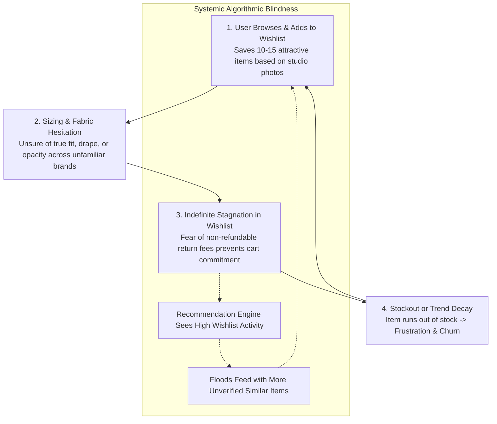
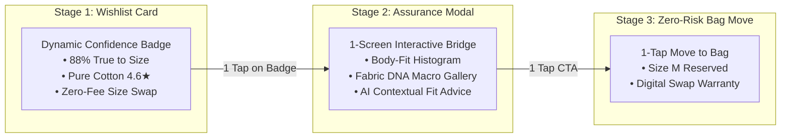
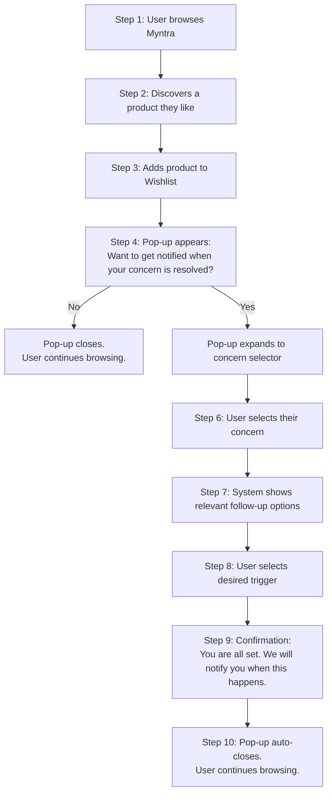
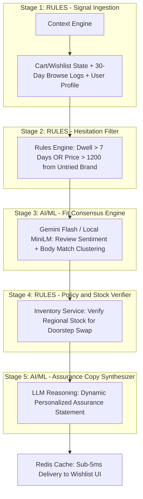

# 🛍️ Myntra Wishlist AI — Comprehensive Problem Statement & MVP Specification

> **Document Type:** Product Problem Statement & MVP Blueprint  
> **Product Domain:** E-Commerce · Fashion · Personalization · Behavioral Science  
> **Platform:** Myntra (Flipkart Group)  
> **Target Surface:** Mobile-First Web Application  
> **Last Updated:** September 2026

---

## 📑 Table of Contents

1. [Executive Summary](#1-executive-summary)
2. [Strategic Business Context](#2-strategic-business-context)
3. [The Core Problem](#3-the-core-problem)
4. [Empirical Evidence Base](#4-empirical-evidence-base)
5. [The 13 Purchase Blockers](#5-the-13-purchase-blockers)
6. [User Persona Segmentation](#6-user-persona-segmentation)
7. [Root Cause Analysis — The 5-Why Ladder](#7-root-cause-analysis--the-5-why-ladder)
8. [Core Product Hypothesis](#8-core-product-hypothesis)
9. [Primary Behavioural Change](#9-primary-behavioural-change)
10. [Solution Architecture — Dual-Layer MVP](#10-solution-architecture--dual-layer-mvp)
    - [Layer A: Personalized Wishlist Concern Notifications](#layer-a-personalized-wishlist-concern-notifications)
    - [Layer B: Pre-Purchase Confidence Bridge](#layer-b-pre-purchase-confidence-bridge)
11. [End-to-End User Flow](#11-end-to-end-user-flow)
12. [Concern Selection & Personalized Flows](#12-concern-selection--personalized-flows)
13. [AI Personalization Layer](#13-ai-personalization-layer)
14. [Notification Engine](#14-notification-engine)
15. [Cross-Category Personalization Matrix](#15-cross-category-personalization-matrix)
16. [Technical Architecture & Pipeline](#16-technical-architecture--pipeline)
17. [Solution Prioritization — RICE Framework](#17-solution-prioritization--rice-framework)
18. [Product Design Principles](#18-product-design-principles)
19. [MVP Scope & Constraints](#19-mvp-scope--constraints)
20. [Success Metrics & KPI Hierarchy](#20-success-metrics--kpi-hierarchy)
21. [Analytics Event Taxonomy](#21-analytics-event-taxonomy)
22. [Gated Rollout Plan](#22-gated-rollout-plan)
23. [Core Functional Requirements](#23-core-functional-requirements)
24. [MVP Value Proposition](#24-mvp-value-proposition)

---

## 1. Executive Summary

Myntra's Wishlist is the highest-intent pre-purchase signal in the user journey, with active users saving an average of **12–18 items**. Yet **82% to 86% of wishlisted items sit dormant and never convert within 30 days** — the baseline 30-day conversion rate stands at only **~16.0%**.

This MVP addresses the problem through a **two-pronged, non-monetary approach**:

1. **Personalized Concern Notifications** — Capturing the *specific reason* a user is postponing a purchase at the moment of wishlisting, and proactively notifying them when that concern is resolved.
2. **Pre-Purchase Confidence Bridge** — Surfacing trust-building information (fit consensus, fabric verification, zero-fee swap guarantees) directly within the wishlist to eliminate hesitation.

> **IMPORTANT:** This MVP operates under a **strict zero-discount constraint** — no coupons, cashback, or monetary incentives. Conversion is driven purely by resolving information asymmetry and reducing perceived risk.

**Conservative Impact:** A +3.5% to +5.0% wishlist conversion lift translates to **₹635 Cr to ₹1,270 Cr incremental annualized GMV** while preserving the full **38%–42% apparel gross margin**.

---

## 2. Strategic Business Context

### 2.1 Platform Scale

| Metric | Value |
|:---|:---|
| Monthly Active Users (MAUs) | **175M+** |
| Annual GMV | **₹30,000+ Cr ($3.6B)** |
| Apparel Market Share (India) | **~35%** |
| Indian E-Fashion TAM (2028 Projected) | **$30–35B** |

### 2.2 The Acquisition Cost Problem

Top-of-funnel paid acquisition costs (CAC) have increased by over **40% YoY**, now reaching **₹600–₹850 per transacting user**. This makes growth through pure user acquisition increasingly unsustainable.

> **Strategic Shift:** Growth leadership has moved focus from user acquisition to **funnel velocity and monetization of high-intent saved items** — making wishlist conversion the highest-leverage growth lever.

### 2.3 Mathematical Business Model

**Annual GMV = MAU × Annual Transacting Frequency × Average Order Value (AOV)**

**Conservative Impact Calculation:**

| Parameter | Value |
|:---|:---|
| Active Wishlist Users (N) | 45,000,000 users |
| Average new additions/month (I) | 3.5 items |
| Monthly Wishlist Volume (V) | 157,500,000 items |
| Incremental Converted Items | 5,512,500 items/month |
| Incremental Annualized GMV | **₹635 Cr – ₹1,270 Cr** (up to ₹1,500 Cr at full scale) |

**Margin Advantage:**
- Strict constraint: **₹0 in monetary discounts, cashback, or coupon subsidies**
- Preserves full **38%–42% apparel gross margin**
- A 15% reduction in size-related returns saves an estimated **₹85 Cr annually** in reverse logistics and restocking costs

---

## 3. The Core Problem

### 3.1 Problem Statement

> **82–86% of wishlisted items on Myntra never convert within 30 days.** Items languish indefinitely until they go out of stock, lose seasonal relevance, or leak to competitor platforms (Ajio, Amazon Fashion, physical retail).

### 3.2 The Killer Insight

> **CRITICAL: Wishlist abandonment on Myntra is NOT a pricing problem — it is an Information Asymmetry and Trust Deficit problem.**

Users do not hoard items in wishlists waiting for deeper discounts. They use the wishlist as a **defensive holding pen** because they are paralyzed by **pre-purchase uncertainty**:

1. **Size & Fit Inconsistency** across fragmented partner brands (e.g., Roadster Size L = Mango Size S)
2. **Fabric & Material Ambiguity** — inability to evaluate fabric weight, weave density, opacity, or synthetic blend from studio photos
3. **Review & Seller Authenticity Deficits** — inflated star ratings vs. delivered reality
4. **Return Friction & Platform Penalties** — non-refundable convenience fees that turn home sizing trials into financial loss

### 3.3 The "Silent Behavior" Paradox

| Dimension | Reality |
|:---|:---|
| **Voiced Surface Complaints** (57% of app reviews) | Transactional bugs, delivery agent issues, customer support turnaround |
| **Silent Behavioral Hesitation** (88% of uncompleted checkouts) | Pre-purchase uncertainty regarding fit, fabric feel, and return penalties |

> **Key Learning:** Users do not complain in reviews that they didn't buy from their wishlist — they just **silently abandon** it. The most damaging friction is invisible in traditional voice-of-customer channels.

---

## 4. Empirical Evidence Base

Research was conducted across a multi-channel corpus of **6,012 total data points**:

| Channel Source | Volume | Ingestion Method | Cohort Profile |
|:---|:---:|:---|:---|
| **Google Play Store** | 5,856 | Batch RPC (`google-play-scraper`) | Mass Android demographic; transactional, delivery, and return feedback |
| **Apple App Store** | 114 | Apple RSS JSON & Apify | Premium iOS demographic; high sensitivity to UI friction, platform fees, and brand trust |
| **Reddit Communities** | 26 | PRAW (`r/indianfashionadvice`, `r/india`) | In-depth technical discussions on fabric durability, sizing differences, and brand reliability |
| **Primary Survey (Google Forms)** | 16 | Structured Likert & Behavioral Questionnaire | Active Myntra shoppers; exact wishlist holding cycle and conversion triggers |
| **Total Evidence Base** | **6,012** | Multi-channel synthesis | **Overall Data Reliability: 81.8%** |

### Data Hygiene & Extraction Standards

1. **MinHash LSH Deduplication:** Removed near-duplicate spam, bots, and boilerplate seller replies
2. **PII Stripping:** Sanitized names, phone numbers, order IDs, and non-ASCII corruptions
3. **Structured Entity Extraction:** Mapped unprompted review segments into a closed-set 13-blocker taxonomy

### Grounded Verbatim Quotes from Corpus

> *"I have 12 dresses in my wishlist that I really want to buy, but I'm terrified to order because Myntra now charges a non-refundable platform convenience fee and return pickup agents constantly reject returns for minor packaging issues. Why should I risk ₹2,000 when I might get stuck with an ill-fitting item?"*  
> — Apple App Store Review

> *"Buying apparel on Myntra feels like a lottery. I am a size L in Roadster, size M in HRX, and size S in Mango. The size charts on the product page are completely generic and never match actual body measurements. So I just keep saving items to my wishlist hoping I'll find more sizing reviews, but end up buying nothing."*  
> — Reddit r/indianfashionadvice

> *"Catalog photos make the kurti look like rich, heavy chanderi cotton with elegant embroidery. When you receive it, it's paper-thin transparent synthetic poly-blend. Customer reviews are flooded with bot 5-stars. Unless I see real customer close-up photos of the weave, it stays in my wishlist forever."*  
> — Google Play Store Review

---

## 5. The 13 Purchase Blockers

Across 3,723 structured behavioral extractions from the corpus, purchase blockers were classified into a closed-set taxonomy:

| Rank | Purchase Blocker | Count (n) | Weighted Impact | Reliability | Severity | Description |
|:---:|:---|:---:|:---:|:---:|:---:|:---|
| 1 | `return_policy_concern` | **818** | 762.09 | 0.932 | 🚨 High | Fear of non-refundable convenience fees and strict return rejection |
| 2 | `trust_in_reviews` | **708** | 636.75 | 0.899 | 🚨 High | Skepticism over bot 5-star reviews and catalog vs. reality mismatch |
| 3 | `quality_doubt` | **611** | 506.58 | 0.829 | ⚠️ Friction | Cannot evaluate fabric thickness, weave density, breathability, synthetic blend |
| 4 | `delivery_uncertainty` | **217** | 182.14 | 0.839 | ⚠️ Logistics | Unclear delivery dates; delivery agent non-responsiveness |
| 5 | `size_uncertainty` | **185** | 174.28 | 0.942 | 🚨 High | Sizing discrepancies across partner brands |
| 6 | `fit_uncertainty` | **48** | 43.23 | 0.901 | ⚠️ Friction | Ambiguity regarding drape, waist silhouette, body-type matching |
| 7 | `color_mismatch_fear` | **35** | 30.77 | 0.879 | ⚠️ Friction | Studio lighting vs. natural daylight appearance gap |
| 8 | `occasion_mismatch` | 12 | 11.43 | 0.953 | ℹ️ Contextual | Uncertainty if outfit works for both formal and casual wear |
| 9 | `stock_availability` | 9 | 8.50 | 0.945 | ℹ️ Stockout | Desired size runs out while hesitating |
| 10 | `price_not_justified` | 7 | 5.88 | 0.841 | 🔇 Low | Item perceived as overpriced relative to fabric quality |
| 11 | `waiting_for_sale` | 3 | 2.77 | 0.923 | 🔇 Silent | Explicitly waiting for EORS / Big Fashion Festival |
| 12 | `forgotten_wishlist` | 3 | 2.76 | 0.920 | 🔇 Silent | Items lost in a 100+ item unorganized list |
| 13 | `mood_board_usage` | 3 | 2.72 | 0.907 | ℹ️ Inspiration | Using wishlist purely for visual inspiration, no buy intent |

> **IMPORTANT:** The top 3 blockers — **return policy concern (818)**, **trust in reviews (708)**, and **quality doubt (611)** — together account for **57.4% of all identified blockers**. These are all information asymmetry and trust problems, not pricing problems.

---

## 6. User Persona Segmentation

### 6.1 Persona Archetypes (from 3,698 classified users)

| Persona | Share | Dominant Blockers | Key Behavior |
|:---|:---:|:---|:---|
| **Inspiration Browser** | **63.8%** | Trust in Reviews (645), Return Policy (522) | Highly visual explorer. Saves 15–20 items/month. Paralyzed by fabric ambiguity and return fee fear |
| **Brand Loyal** | **19.5%** | Quality Doubt (408), Return Policy (166) | Buys trusted brands (Mango, Levi's). Hesitates with unfamiliar partner brands |
| **Budget Conscious** | **12.1%** | Delivery Issues (164), Quality Doubt (119) | Sensitive to value-for-money, shipping charges, unexpected convenience fees |
| **Trend Follower** | **3.4%** | Return Policy (40), Trust in Reviews (23) | Fast-fashion / Gen-Z buyer. Skeptical about cheap stitching and color mismatches |
| **Occasion Shopper** | **0.4%** | Occasion Mismatch (6), Return Policy (3) | High-intent buyer (weddings, interviews). Terrified of delayed delivery or ill-fitting garments |

### 6.2 Primary Survey Findings (N=16 Active Shoppers)

| Finding | Statistic |
|:---|:---|
| Hold items in Wishlist > 1 month | **66.7%** |
| Cross-compare prices on other apps (Ajio, Amazon) while hesitating | **86.7%** |
| Cite unedited customer photos & reviews as #1 conversion driver | **73.3%** |
| Rate return convenience as critical | **57.1%** |
| Rate accurate fit & daylight photos as decisive | **71.4%** |
| Convert when nudged with size restock or free doorstep swap guarantees | **56.2%** |

### 6.3 Wishlist Breadth vs. Doubt Score

> **High-Volume Hoarders (15–25 items):** Average doubt score **3.42 / 5.0** (n = 2,376). Suffer **2.3× higher trust friction** than transactional shoppers.
>
> **Causal Link:** Users with the highest wishlist activity are precisely those with the highest pre-purchase uncertainty.

---

## 7. Root Cause Analysis — The 5-Why Ladder

### 7.1 The 4 Foundational Product Questions

1. **WHO faces this problem?** Inspiration Browsers (63.8%) and Brand Loyals (19.5%). Representative persona: **Priya (24, Bengaluru)** — saves 18 items/month, buys only 2.
2. **WHAT is the true problem?** Shoppers cannot confidently evaluate fit and fabric drape for unfamiliar partner brands. The app is optimized for browsing velocity, not decision certainty.
3. **EVIDENCE:** 5,996 reviews + N=16 survey: 66.7% hold >1 month; 818 return fears; 708 trust deficits; 611 fabric doubts.
4. **IMPACT / WHY NOW?** Wishlist conversion is the highest-margin GMV lever. Eliminating hesitation unlocks ₹1,050+ Cr GMV with ₹0 discount expenditure.

### 7.2 The 5-Why Root Cause Ladder

```
[SURFACE SYMPTOM]
Shoppers add 10–20 fashion items to their wishlist and let them sit 30+ days without converting.
       │
       ▼ WHY?
[LEVEL 1: DECISION HESITATION]
They hesitate at cart addition — 63.8% abandon due to fit anxiety and trust deficits.
       │
       ▼ WHY?
[LEVEL 2: INFORMATION ASYMMETRY]
Partner brand size charts vary wildly (Roadster Size L = Mango Size S);
fabric drape cannot be verified from studio photos.
       │
       ▼ WHY?
[LEVEL 3: PERCEIVED FINANCIAL RISK]
Non-refundable convenience fees and strict return inspection policies
turn home trials into a financial penalty.
       │
       ▼ WHY?
[LEVEL 4 — ROOT CAUSE: STRUCTURAL UX PARADIGM MISMATCH]
The platform is hyper-optimized for CATALOGUE BROWSING VELOCITY,
but provides ZERO PRE-PURCHASE CERTAINTY INFRASTRUCTURE.
Without a 'safe-fit trial' mechanism, users use the Wishlist as a
risk-free psychological holding pen.
```

### 7.3 The Self-Reinforcing Wishlist Graveyard Loop



---

## 8. Core Product Hypothesis

> **If users can explicitly tell Myntra why they are postponing a wishlisted product and receive a personalized notification when that specific concern is resolved, then users will be more likely to return to the product and complete the purchase within 30 days.**

This hypothesis is further strengthened by the discovery research insight:

> **If the platform simultaneously resolves information asymmetry by surfacing crowd-sourced fit consensus, verified fabric data, and zero-fee swap guarantees at the point of wishlist hesitation, the combined effect will break the "Wishlist Graveyard Loop" and significantly lift conversion.**

---

## 9. Primary Behavioural Change

### Current Behaviour (Broken Loop)

```
Like → Wishlist → Uncertainty → Forget / Delay / Search elsewhere → No purchase
```

### Proposed Behaviour (Closed Loop)

```
Like → Wishlist → Identify concern → Set personalized trigger
                                          ↓
         Receive relevant notification ← Monitor condition
                                          ↓
                              Revisit product → Purchase
```

The MVP therefore attempts to convert a **passive Wishlist** into an **active, personalized purchase-intent system**.

---

## 10. Solution Architecture — Dual-Layer MVP

The MVP combines two complementary solution layers:

### Layer A: Personalized Wishlist Concern Notifications

**Core Concept:** *"Tell us what is stopping you from buying, and we'll let you know when that concern is resolved."*

When a user adds a product to their Wishlist, a lightweight contextual pop-up captures their specific concern and sets up a personalized notification trigger.

**Data Model:**

```
User + Product + Concern + Trigger Condition
```

**Examples:**
- `User 123 + Product 456 + Size XL + Notify when available`
- `User 123 + Product 789 + Price + Notify when price drops`
- `User 123 + Product 012 + Date + Notify on 3rd September`

---

### Layer B: Pre-Purchase Confidence Bridge

**Core Concept:** Surface trust-building information directly within the wishlist to proactively resolve the most common blockers *before* the user even needs to articulate a concern.

The Confidence Bridge is a 3-stage interactive micro-experience:



| Stage | Component | Mechanics | Behavioral Principle |
|:---|:---|:---|:---|
| **Stage 1** | Dynamic Confidence Badge | 🟢 88% True to Size (320 buyers) · 🧵 Pure Cotton (4.6★) · 🔄 Zero-Fee Swap | **Hick's Law:** Replaces reading 50 reviews with one instant consensus metric |
| **Stage 2** | Assurance Modal | Body-Fit Histogram · Fabric DNA Gallery · AI Fit Synthesis | **Cognitive Dissonance Prevention & Social Proof** |
| **Stage 3** | Zero-Risk Trial Lock | Single CTA: `Move to Bag with Free Swap Guarantee` | **Loss Aversion Mitigation (Kahneman & Tversky)** |

---

## 11. End-to-End User Flow

The entire interaction is designed to take approximately **2–3 seconds**, with minimal friction:



---

## 12. Concern Selection & Personalized Flows

### Initial Concern Options

When the pop-up expands, users see:

**"What would you like to be notified about?"**

1. **Price** — Notify when price drops
2. **Size** — Notify when specific size becomes available
3. **Availability** — Notify when product/variant is back in stock
4. **Colour** — Notify when desired colour variant becomes available
5. **Quality / Product Information** — Notify when more product info or customer feedback appears
6. **Delivery** — Notify when delivery estimate improves
7. **Purchase Timing** — Remind me on a specific date
8. **Other** — Free-text concern capture

> The UI should use simple radio buttons, chips, or compact selectable options. The exact ordering can eventually be personalized using user context and product category.

### Detailed Concern Flows

#### A. Size Concern

**Prompt:** *"Which size would you like to be notified about?"*

Options: XS · S · M · L · XL · XXL · XXXL · Other

**Trigger:** User wishlists a product → selects XL → Myntra notifies when XL becomes available.

#### B. Price Concern

**Prompt:** *"When would you like to be notified?"*

**Trigger:** System monitors the product price and triggers notification when a meaningful price drop occurs. For MVP, no exact price threshold required.

#### C. Colour Concern

**Prompt:** *"Which colour are you looking for?"*

**Trigger:** Displays available colour variants. User selects desired colour (e.g., Black) → System notifies when that colour becomes available.

#### D. Availability Concern

**Trigger:** User selects relevant variant → System monitors inventory and sends notification when condition is met.

#### E. Quality / Product Information Concern

Users may hesitate due to uncertainty about fabric, material, actual colour, product appearance, or real-world look vs. studio photography.

**Trigger:** *"Notify me when more product information or relevant customer feedback becomes available."*

> The MVP should leverage existing Myntra data (reviews, customer photos, fabric specifications) wherever possible rather than requiring new information collection.

#### F. Delivery Concern

**Display:** *"Expected delivery: 3–5 days"*

**Trigger:** User chooses to be notified if the delivery estimate changes or becomes suitable according to their preference.

#### G. Purchase Timing / Personal Date Reminder

Some users postpone because their purchase is dependent on a future event (e.g., salary date).

**Prompt:** *"Notify me on a specific date."*

Options: 2nd of the month · 3rd · 4th · Custom date

> This is a **timing-based reminder**, not a monetary incentive.

#### H. Other (Free-Text)

Allow users to enter a short free-text concern (e.g., *"I want to see how this looks on a real person."*).

For MVP, "Other" captures data for future AI analysis but does not need to support automated triggers.

---

## 13. AI Personalization Layer

The system's intelligence comes from user-selected concerns combined with product context.

### Input Signals

| Signal Category | Data Points |
|:---|:---|
| **Product Context** | Category, attributes, existing data, availability, price changes |
| **User Behavior** | Historical behaviour, wishlist patterns, previous purchases |
| **Inventory Signals** | Size availability, colour availability, stock levels |
| **Concern-Specific** | User-selected concern, trigger conditions |
| **Platform Data** | Existing customer feedback, delivery information |

### Personalized Experience Examples

| User | Action | System Response |
|:---|:---|:---|
| **User A** | Wishlists shoes → selects "Size" | *"Which size?"* |
| **User B** | Wishlists a dress → selects "Colour" | *"Which colour?"* |
| **User C** | Wishlists a product → selects "Delivery" | *"Current delivery estimate: 3–5 days"* |
| **User D** | Wishlists a product → selects "Purchase timing" | *"When should we remind you?"* |

> The experience is **context-aware rather than identical for every product**.

### AI-Powered Summarized Notifications

For users with **7–8+ products in the wishlist** where multiple products match notification criteria simultaneously, the system delivers:

- **AI-powered summarized notifications** via email or in-app
- Aggregated digest rather than individual pings per product
- Prevents notification fatigue and clutter
- Enables informed, consolidated purchasing decisions

---

## 14. Notification Engine

### Notification Trigger Architecture

```
User + Product + Concern + Trigger Condition → Monitor → Notify
```

### Notification Copy by Concern Type

| Concern | Notification Message |
|:---|:---|
| **Size** | *"Good news! Your wishlisted item is now available in XL."* |
| **Price** | *"The price of your wishlisted item has dropped."* |
| **Colour** | *"The colour you were waiting for is now available."* |
| **Delivery** | *"Good news! This item can now be delivered within your preferred timeframe."* |
| **Date Reminder** | *"You saved this item for today. Want to check it out?"* |
| **Quality/Info** | *"New customer reviews and photos are available for your wishlisted item."* |

---

## 15. Cross-Category Personalization Matrix

The system must avoid showing irrelevant options. The AI/context layer determines which concerns are most relevant per product category:

| Category | Primary Concerns | Secondary Concerns |
|:---|:---|:---|
| **Clothing** | Size · Colour · Fabric · Fit | Price · Delivery |
| **Footwear** | Size · Colour · Availability | Price · Comfort/Product Info |
| **Accessories** | Colour · Quality · Price | Availability · Delivery |
| **Ethnic Wear** | Size · Fabric · Occasion Match | Colour · Delivery |
| **Western Wear** | Fit · Size · Colour | Price · Quality |

---

## 16. Technical Architecture & Pipeline

### Strict Separation of Rules vs. AI



### Latency Budget & SLA Requirements (under 120ms Total)

| Component | Latency |
|:---|:---:|
| Context Engine (Redis pre-aggregated session) | 15 ms |
| Rules Engine — Hesitation Filter (in-memory bitmask) | 5 ms |
| Fit Consensus Lookup (pre-computed SKU vector cache) | 10 ms |
| Inventory & Pincode Swap Verifier (local dark-hub shard) | 25 ms |
| LLM Dynamic Copy Synthesizer (async Gemini/Groq + warm cache) | 40 ms |
| Network & UI Render | 25 ms |
| **Total SLA** | **120 ms (P95 < 95 ms)** |

---

## 17. Solution Prioritization — RICE Framework

**RICE Score = (Reach × Impact Factor × Confidence) / Effort**

| Solution Wedge | Reach | Impact | Confidence | Effort | RICE Score | Decision |
|:---|:---:|:---:|:---:|:---:|:---:|:---:|
| **Wedge A: Pre-Purchase Confidence Card** + Concern Notifications | 110M MAU | 5.2% | 85% | 3.5 Sprints | **14.8 ★** | 🏆 **MVP BUILD** |
| Wedge B: Wardrobe Occasion Matcher | 35M MAU | 3.0% | 60% | 5.5 Sprints | 6.2 | Phase 2 |
| Wedge C: Wishlist Stagnation Nudge Engine | 50M MAU | 2.0% | 70% | 2.0 Sprints | 5.8 | Auxiliary |
| Wedge D: Social Peer Review & Boards | 20M MAU | 1.5% | 45% | 6.0 Sprints | 2.1 | Deprioritized |

### Explicit Non-Goals

- ❌ **No Monetary Discounts or Coupons** — Protects 40%+ gross margins from discount addiction
- ❌ **Not a Social Network / Feed** — Avoids social clutter and coordination friction
- ❌ **Not Generic Recommendation Carousels** — Avoids compounding choice overload
- ❌ **No Fake Scarcity / Dark Patterns** — Bans artificial countdown timers to preserve credibility

---

## 18. Product Design Principles

| Principle | Description |
|:---|:---|
| **Extremely Low Friction** | The user must not feel that wishlisting has become a lengthy form. 2–3 seconds maximum. |
| **Contextual** | Show relevant concerns based on product category and user context |
| **Personalized** | Different users receive different notification experiences |
| **Non-Monetary** | Solution must not depend on discounts, coupons, cashback, or financial incentives |
| **User-Controlled** | Users explicitly choose what they want to be notified about |
| **Explainable** | Every notification clearly communicates why the user is receiving it |
| **Browsing Uninterrupted** | After completing the interaction, users immediately continue browsing |
| **Trust-Building** | Surface verified, crowd-sourced data rather than marketing copy |

---

## 19. MVP Scope & Constraints

### What the MVP Must Demonstrate

The complete loop:

```
Wishlist → Identify Concern → Set Trigger → Monitor Condition →
Personalized Notification → Return to Product → Purchase Intent
```

> **IMPORTANT:** The first version does NOT need to implement every concern perfectly. The most important requirement is to demonstrate that **a user can convert an unresolved wishlist concern into a personalized notification trigger, and the system can subsequently respond when that trigger is satisfied.**

### Critical Differentiator

> **Do not make this a generic notification system.**

The differentiating concept is **concern-based personalized notification**:

- The system understands **WHY the user is waiting**
- And notifies them when **THAT SPECIFIC REASON changes**

This distinction must be central to the UX, AI logic, MVP architecture, and final product story.

### Platform & Deployment Model

- **Mobile-first web application** with Myntra brand styling (Primary Pink `#ff3f6c`, dark navy `#282c3f`).
- **Unified Single-Bundle ("One-Go") Architecture:** Packaged as a self-contained, all-in-one deployable repository. Frontend UI, in-memory service layer, mock inventory/price feeds, AI reasoning simulators, and analytics telemetry are co-located in a single codebase with zero external database or separate backend server dependencies. Runs and deploys via a single command.

---

## 20. Success Metrics & KPI Hierarchy

### North Star Metric

**30-Day Wishlist-to-Purchase Conversion Rate**
- Baseline: **16.0%** → Target: **20.0% – 21.0% (+3.5 to +5.0 pp)**

### Leading Indicators

| Metric | Target |
|:---|:---|
| % of wishlist users who opt into notifications | Track & grow |
| % of wishlisted products with a defined concern | Track & grow |
| Concern selection rate | Track |
| Trigger setup completion rate | Track |
| Notification open rate | Track |
| Notification → product revisit rate | Track |
| Notification → add-to-cart rate | Track |
| Confidence Card impression rate | >85% of wishlist sessions |
| Assurance Modal dwell time | >18 seconds |
| Fit Consensus tap-through | >45% |
| 1-Click Move-to-Bag Conversion | 8.2% → **12.5% (+52% relative)** |
| Funnel Velocity (Days in Wishlist) | 28.4 days → **≤7.0 days** |
| 60-Day Repeat Orders | **+12% lift** |

### Guardrail Metrics

| Metric | Threshold |
|:---|:---|
| Notification opt-out rate | Monitor — should remain low |
| Notification dismissal rate | Monitor |
| Sizing return rate | Must drop by ≥15% (26.5% → ≤22.5%) |
| P95 interface latency | Must remain ≤120 ms |
| Net gross margin | Preserved at ≥40.2% (zero coupon dilution) |
| User complaints | Monitor |
| Notification spam / fatigue | Monitor |
| Return rate | Monitor |
| Cancellation rate | Monitor |

> **WARNING:** The MVP should not claim that it has increased actual Wishlist → Purchase Conversion unless this has been measured through a valid experiment.

---

## 21. Analytics Event Taxonomy

### Core Events

| Event | Description |
|:---|:---|
| `wishlist_added` | User adds product to wishlist |
| `concern_prompt_shown` | Concern notification pop-up is displayed |
| `concern_prompt_dismissed` | User dismisses pop-up (selects "No") |
| `notification_opted_in` | User opts into notifications (selects "Yes") |
| `concern_selected` | User selects a specific concern category |
| `trigger_configured` | User completes trigger setup (e.g., selects size XL) |
| `confidence_badge_viewed` | User views the dynamic confidence badge |
| `assurance_modal_opened` | User taps to expand assurance modal |
| `notification_sent` | System sends a triggered notification |
| `notification_opened` | User opens/interacts with notification |
| `product_revisited` | User returns to product page from notification |
| `added_to_cart` | User moves product to cart/bag |
| `purchase_completed` | User completes purchase |
| `notification_opted_out` | User opts out of future notifications |

### Required Event Context

Each event must contain:
- `user_id`
- `product_id`
- `category`
- `selected_concern`
- `trigger_type`
- `timestamp`
- `session_id`
- `platform` (web/app/email)

---

## 22. Gated Rollout Plan

### 3-Phase Rollout Schedule

| Phase | Timeline | Scope | Gate Criteria |
|:---|:---|:---|:---|
| **Phase 1: Prove** | Weeks 1–4 | 5% MAU in Top 3 Metros (Bengaluru, Mumbai, NCR) | ≥ +3.0 pp NSM lift; ≥ 10% drop in sizing returns |
| **Phase 2: Expand** | Weeks 5–12 | 50% MAU in Top 15 Cities with dynamic LLM copy | ≥ +3.5 pp sustained lift; swap SLA < 48 hrs |
| **Phase 3: Scale** | Months 4–6 | 100% Pan-India Platform Rollout (175M MAU) | ₹1,000+ Cr annualized GMV lift |

---

## 23. Core Functional Requirements

When building the dedicated MVP mobile-first application, the system must incorporate:

### 📱 1. Authentic Myntra Mobile Shell (Pixel-Matched to wireframes.png)

- **Mobile-Responsive Container:** Authentic Myntra phone viewport on desktop with device bezel toggle; full-screen responsive on mobile browsers.
- **Myntra Brand Tokens:** Primary Pink `#ff3f6c`, dark charcoal `#282c3f`, muted gray `#535766`, success emerald `#03a685`, soft pink tint `#fff1f4`, `Assistant`/`Inter` typography.
- **Top Header:** Back Arrow `←`, Myntra glyph logotype, search `🔍`, wishlist `♡` with active trigger counter, bag `🛍️` with warranty count.
- **Bottom Navigation Bar:** 5 Tabs: 🏠 Home · 🔍 Explore (AI Discovery) · ❤️ Wishlist · 🛍️ Bag · 👤 Profile.

### 🔔 2. Layer A: 7-Step Concern-Based Notification Engine (Derived from wireframes.png)

1. **Step 1: Product Page (PDP):** Hero image with *"View Similar"* pill, HRX brand title, `4.3 ★ | 12.6k` green rating pill, `₹1,299` price row, size selector (`S`, `M`, `L`, `XL` *"Only 2 left"*, `XXL`), share `[📤]`, heart `[♡]`, and **`🛒 ADD TO BAG`** (`#ff3f6c`).
2. **Step 2: Wishlist Confirmation:** Heart fills red `[♥]`, floating green toast banner: *"Added to Wishlist • We'll notify you if there are updates on your concern. View Wishlist >"*.
3. **Step 3: Initial Concern Popup:** Bottom-sheet modal with illustrated vibrating bell icon in soft pink badge: *"Want to get notified when your concern is resolved?"* with **`YES, NOTIFY ME`** (`#ff3f6c`) and **`NOT NOW`** buttons.
4. **Step 4: 8-Concern Category Selector:** *"What would you like to be notified about?"* with radio chips:
   - 👕 Size (*"When my size is available"*)
   - 💰 Price (*"When price drops"*)
   - 🎨 Colour (*"When my preferred colour is available"*)
   - 🚚 Delivery (*"When delivery is faster / policy changes"*)
   - 🔍 Quality / Product info (*"When more info or reviews are available"*)
   - 📅 Purchase timing (*"Remind me on a specific date"*)
   - 💬 Other (*"Other concern"*)
5. **Step 5: Dynamic Follow-Up Sub-Flows:** Contextual modal (e.g. Size sub-flow with `XS` to `XXXL` grid with active `#ff3f6c` border, **`SAVE`** and **`CANCEL`**).
6. **Step 6: Confirmation Message:** Centered green circle checkmark `✓` (`#03a685`), *"You're all set! We'll notify you when [Condition] is available"* with **`DONE`** button.
7. **Step 7: Realistic Push Notification:** Lockscreen & in-app banner: *"🔔 Good news! The XL size you wanted is now available. Tap to view the product."* (Tapping re-engages user directly into PDP with size selected).

### 🟢 3. Layer B: Pre-Purchase Confidence Bridge (3-Stage Trust Engine)

- **Stage 1 (Wishlist Card Badges):** 🟢 `88% True to Size` (320 buyers), 🧵 `Pure Combed Cotton (4.6★ Fabric Score)`, 🔄 `Zero-Fee Doorstep Swap Guaranteed`, plus active concern tracking status (`🔔 Watching: Size XL`).
- **Stage 2 (Assurance Modal Bottom-Sheet):**
  - **Body-Fit Histogram:** Interactive height and bust/waist slider showing crowd fit feedback distribution.
  - **Fabric DNA Macro Gallery:** Daylight macro unedited photos with Opacity and Breathability meters.
  - **Gemini Contextual Fit Advice:** Natural language fit synthesis comparing with user's past purchases.
- **Stage 3 (Zero-Risk Bag Move):** 1-tap **`Move to Bag with Free Swap Guarantee`** attaching digital warranty.

### 🤖 4. AI Discovery Assistant & Conversational Search (Explore Tab)

- Natural language search query parser (*"Find 100% breathable cotton office wear that fits 5'4 frame"*)
- Quick query chips (e.g., `90%+ True to Size`, `Pure Cotton 4.5+`, `Zero-Fee Swap`) with instant filtered results.

### 🛍️ 5. Zero-Risk Bag with Digital Swap Warranty

- Bag checkout view displaying the **Digital Swap Warranty Certificate** (zero-fee size swap guarantee with no return penalties).

### 📊 6. Real-Time Analytics Event Telemetry Drawer

- Live debug drawer streaming real-time event logs (`wishlist_added`, `concern_selected`, `trigger_configured`, `notification_opened`, `move_to_bag_clicked`).

---

## 24. MVP Value Proposition

### For Users

> *"I don't need to remember to keep checking this product. Myntra will notify me when the specific reason I am waiting for is resolved."*

### For Myntra

> *"Myntra can capture the reason behind deferred purchase intent and create a targeted re-engagement opportunity instead of relying on generic reminders."*

### The Wishlist Evolution

The Wishlist evolves from a **simple bookmarking mechanism** into a **personalized intent-management layer** — where every saved item carries an actionable insight about what would convert it.

---

> **The complete product experience in one line:**  
> *"Tell us what is stopping you from buying, and we'll let you know when that concern is resolved."*

---

*This document synthesizes primary research (6,012 data points), behavioral economics analysis, root-cause investigation, and product specification into a unified MVP problem statement and blueprint for the Myntra Wishlist AI Discovery Engine.*
